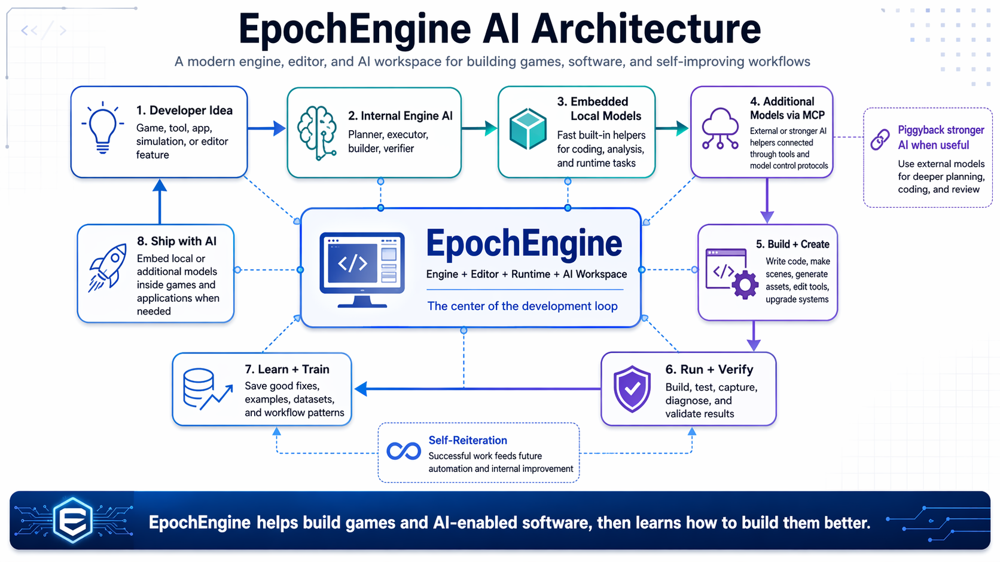

# Adam Rushford · @Autodidac

YouTube: https://youtube.com/@adamrushford  
GitHub: https://github.com/Autodidac

---

## C++23 Engine Architect / Graphics Programmer / AI-Enabled Software Developer

I’m building **EpochEngine**: a modern C++23 creative software and game engine platform for building games, tools, editors, simulations, pipelines, and AI-enabled applications from one serious engine codebase.

Epoch is not just another “game engine” repo.

It is being designed as an engine, editor, runtime, automation layer, AI development surface, and software creation platform — with actual game support included instead of using “game engine” as a label for tech demos.

---

## EpochEngine AI Architecture

EpochEngine is designed around a loop where the engine, editor, runtime, local AI models, embedded models, external MCP-connected helpers, and verification systems all work together.

The goal is simple:

**Build the project, test the project, learn from the work, improve the engine, and repeat.**

That means Epoch is not only using AI as a side assistant. AI is part of the development structure.

---

## Main Project

### [EpochEngine](https://github.com/Autodidac/EpochEngine)

**EpochEngine** is my main project and the center of my development ecosystem.

It is a C++23 modular engine and creative software platform focused on:

- Real game development
- AI-enabled software
- Editor-driven workflows
- Runtime project execution
- Multi-backend rendering
- Procedural and time-based simulation
- Automated development loops
- Engine-aware AI tooling
- Cross-platform software creation

Epoch is built around a modern engine direction, not the older design assumptions behind traditional engines.

Unreal, Unity, and Godot are powerful, proven systems, but their core workflows come from earlier generations of engine design: editor-first usage, asset-pipeline-heavy development, scripting-layer separation, plugin ecosystems, and mostly human-driven iteration.

EpochEngine is being pushed toward the next model:

- The engine owns more of the development loop.
- The editor is not just a GUI; it is part of the automation surface.
- The runtime is not just for games; it supports tools, software, simulations, and generated projects.
- AI is not bolted on as a gimmick; it is intended to operate, inspect, test, train, and improve the engine workflow.
- Development output can become training data.
- Local embedded models can ship inside games, tools, and applications when useful.
- Additional local models can assist the editor/runtime without forcing everything through one model.
- MCP-connected helpers can extend the system with stronger external planning, coding, review, asset, and automation tools.
- Stronger external AI systems can be used to piggyback and improve local engine intelligence.
- Build, run, capture, verify, diagnose, and iterate loops are first-class goals.

The point is not to copy old engines.

The point is to build an AI-enabled software and game creation system.

---

## What Epoch Is Becoming

EpochEngine is being built as:

- A C++23 modules-first engine
- A real-time renderer and runtime
- A game development framework
- A creative software platform
- A project generator
- An editor and tooling application
- A simulation system
- A procedural content foundation
- An AI-assisted development environment
- A self-verifying build/test/run platform
- A training-data source for future AI workflows
- A host for embedded local AI models in games and applications
- A control surface for MCP-connected external and local AI helpers

This is meant to support actual games, actual tools, actual software, and actual automated development.

Not just screenshots.

Not just samples.

Not just another editor shell.

---

## AI Self-Iteration Direction

A major part of EpochEngine is the AI development loop.

The direction includes:

- AI-assisted coding
- AI-assisted refactoring
- AI-assisted debugging
- Engine-aware task execution
- Automated build verification
- Runtime launch and capture validation
- Screenshot/log/artifact-based testing
- Training-data generation from real engine use
- Local AI model integration
- Embedded model support inside generated projects
- Additional local model support for specialized runtime/editor tasks
- External model piggybacking for stronger planning and review
- MCP-connected tools, models, and automation workers
- Curated promotion of successful fixes and workflows
- Engine-integrated AI control surfaces
- Internal coding, upgrading, testing, and verification loops

The long-term goal is for Epoch to help build Epoch.

That means the editor, runtime, build tools, diagnostics, scripts, datasets, MCP tools, embedded models, and AI control layer all move toward one connected development system.

---

## Why Epoch Is Different

Traditional engines usually separate the world into:

- Engine
- Editor
- Runtime
- Scripting
- Plugins
- Build tools
- External automation
- External AI assistants

EpochEngine is being designed to pull more of that into one connected system:

- Engine + editor + runtime
- Game + software project support
- Internal AI development loop
- Embedded local models
- Additional local helper models
- MCP-connected external helpers
- AI-assisted development
- Automated verification
- Local/external model cooperation
- Runtime captures and diagnostics
- C++23 scripting compiled with the engine/project
- Project shells for real generated work
- Tooling that can eventually inspect and improve the system it belongs to

That is the real difference.

Epoch is not only a game engine.

It is an AI-enabled engine/editor/application platform for building games, software, tools, and future automated development workflows.

---

## Current Focus

- Building EpochEngine into a usable C++23 engine platform
- Stabilizing editor, launcher, windowing, and rendering systems
- Expanding multi-context rendering across supported backends
- Improving asset, shader, GUI, and project workflows
- Building stronger runtime/project shell support
- Adding actual game-facing systems
- Developing AI-assisted build/test/verify workflows
- Connecting local and external AI tooling into the engine workflow
- Supporting embedded local models inside generated software and games
- Keeping the codebase fast, modular, practical, and maintainable

---

## Supporting Work

I’ve built a lot of older experiments around procedural generation, voxel engines, Vulkan setup, Win32 tooling, C++ utilities, templates, and local AI/MCP-style workflows.

Those projects are not the main focus anymore.

They are background research and tool fragments feeding into the bigger system.

EpochEngine is the shining star.

---

## Development Goal

My goal is to build a serious C++23 engine and AI-enabled creative software platform that can support:

- Games
- Tools
- Editors
- Simulations
- Procedural systems
- AI-enabled software
- Embedded AI applications
- Runtime project generation
- Automated development workflows
- Cross-platform application creation

The target is a working engine ecosystem that helps create, test, automate, improve, and ship real projects.

---

## Connect

- GitHub: https://github.com/Autodidac
- YouTube: https://youtube.com/@adamrushford

Contributions, feedback, testing, and collaboration are welcome.
